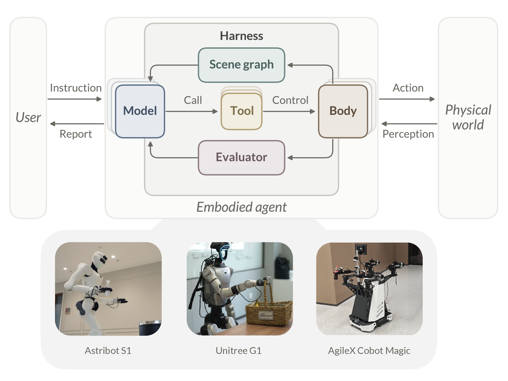

# Thea Harness

`thea-harness` is the provider-neutral orchestration runtime described in
*Towards the Harness of Embodied Agents*. For each Turn, it refreshes physical
context, requests one model decision, executes at most one selected Tool, and
continues from the resulting evidence. Configured physical actions are judged
through Evaluation as Exit Codes before execution-derived state is accepted.

The package contains no robot SDK or hardware-specific service. A deployment
connects its model, Tools, Observation, Scene Graph, Evaluation, Memory, and
safety providers through the public Python boundaries below.

<p align="center">
  
</p>

## Install

Python 3.10 or newer is supported.

From the repository root:

```bash
python -m pip install ./harness
```

Install the model adapter needed by the deployment:

```bash
python -m pip install './harness[anthropic]'
python -m pip install './harness[openai]'
python -m pip install './harness[all]'
```

The distribution name is `thea-harness`; Python code imports `harness`.

After configuring a real model credential and `config.yaml`, the installed
terminal entry point runs the Harness without Lark, simulation, or robot
integration:

```bash
cp harness/config.example.yaml config.yaml
export ANTHROPIC_API_KEY=...
thea-cli --config config.yaml
```

Pass `--instruction "..."` to run one Task and exit.

## Run One Task

One call to `run_stream()` executes one instruction-driven Task and ends with
exactly one `done` event when the stream is fully consumed. This minimal
example injects a deterministic model and one in-process Tool:

```python
from harness import Harness, ModelResponse, ToolCall, ToolRegistry


class DemoModel:
    def __init__(self):
        self.turn = 0

    def call(self, context, tools=None):
        self.turn += 1
        if self.turn == 1:
            return ModelResponse(
                tool_calls=[
                    ToolCall(
                        id="echo-1",
                        name="echo",
                        arguments={"text": "hello"},
                    )
                ],
                stop_reason="tool_use",
            )
        return ModelResponse(text="Done.", stop_reason="stop")


registry = ToolRegistry()


@registry.tool(description="Echo text.")
def echo(text: str) -> dict:
    return {"success": True, "observation": text}


harness = Harness(
    {
        "servers": [],
        "context": {"compaction": {"enabled": False}},
    },
    model=DemoModel(),
    registry=registry,
)

try:
    for event in harness.run_stream("Echo hello."):
        print(event)
finally:
    harness.close()
```

## Extend the Harness

Choose the boundary that matches what the deployment needs to add:

| Goal | Public boundary | Guide |
|---|---|---|
| Understand Turn, Task, Session, and context lifetimes | Call `Harness.run_stream()` and let the Harness own accumulated history and compaction. | [Runtime and Context](docs/concepts.md) |
| Select a model or add a capability | Configure a built-in provider or implement `ModelProtocol`; register Python or MCP-backed Tools through `ToolRegistry`. | [Models and Tools](docs/model-and-tools.md) |
| Publish current physical evidence | Implement `ObservationProvider`; optionally provide four-direction clearance through `BaseClearanceProvider`. | [Observation and Safety](docs/observation-and-safety.md) |
| Preserve cross-turn world state | Implement `SceneGraphProtocol` and register the ref-keyed query Tools exposed by the backend. | [Scene Graph](docs/scene-graph.md) |
| Judge a physical outcome | Give a Tool a post-condition, retain post-execution evidence by `run_id`, and implement `EvaluatorProtocol`. | [Evaluation](docs/evaluation.md) |
| Retain experience or task procedures | Configure `FileMemory`, a Skill directory, and the active Embodiment Profile as needed. | [Memory, Skills, and Embodiment](docs/memory-and-skills.md) |
| Assemble a complete deployment | Compose the selected boundaries and make their resource ownership explicit. | [Deployment Guide](docs/deployment.md) |

The complete public configuration and import surfaces are also available in
the [Configuration reference](https://eit-hai.github.io/thea/documentation/reference/configuration.html)
and [API reference](https://eit-hai.github.io/thea/documentation/reference/api.html).

## Compose a Deployment

The application creates one `Harness` from deployment-owned resources:

```python
from harness import Harness


def build_harness(config):
    robot = connect_robot()
    return Harness(
        config,
        model=build_model(config),
        memory=build_memory(config),
        registry=build_tool_registry(robot),
        observation_provider=build_observation_provider(robot),
        base_clearance_provider=build_base_clearance_provider(robot),
        scene_graph=build_scene_graph(robot),
        evaluator=build_evaluator(config),
        post_execution_observation_provider=build_post_execution_observer(robot),
        owned_resources=(robot,),
    )
```

Start with the copyable
[`examples/port-template/`](../examples/port-template/) when connecting a
physical robot. The [Port to Your Robot](../docs/harness/port-to-your-robot.md)
guide explains the three deployment files; the
[Deployment Guide](docs/deployment.md) covers replacement order, lifecycle,
cancellation, logging, and failure handling.

## Safety

Prompt text and Harness checks do not replace emergency stops, collision
avoidance, actuator limits, or deployment authorization. Runtime YAML and MCP
process settings are trusted operator configuration.

## Development

```bash
python -m pip install -e './harness[dev,all]'
cd harness
python -m pytest -q
python -m ruff check .
python -m ruff format --check .
python -m build
```

See the repository [contribution guide](../CONTRIBUTING.md) for project-wide
requirements.

The package uses Apache License 2.0. See [LICENSE](LICENSE) and
[NOTICE](NOTICE).
